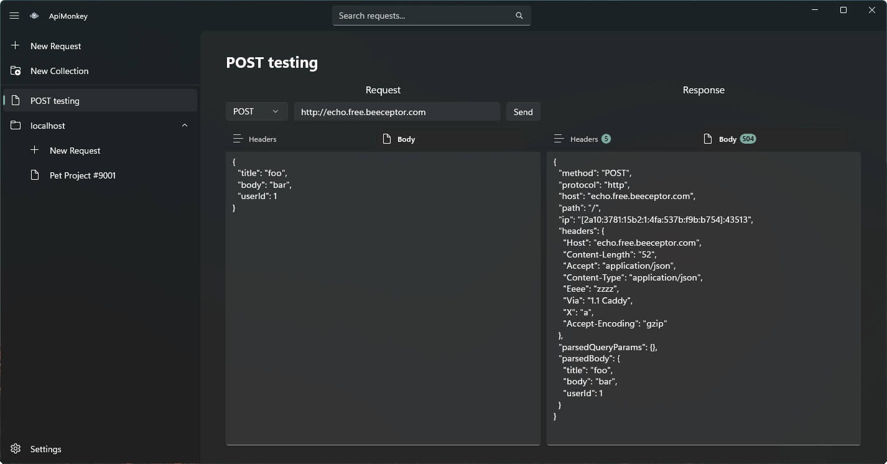

# 🐵 Makapi

A lightweight Windows API client for developers who just want to send requests. No account, no cloud sync, no bloat. Built with WinUI 3, Makapi stores everything as plain JSON files on your disk, making it easy to version-control your requests alongside your code.

<div align="center">

  

</div>

> [!NOTE]
> This project was built as a personal programming exercise. The goal was simply to write some code and build something. It is not actively maintained and is provided here for educational purposes only. Feel free to explore the code, but don't expect updates or support.

## 📸 Screenshot

<div align="center">

  

</div>

## ✨ Features

- **Send HTTP requests** — supports GET, POST, PUT, DELETE, PATCH, HEAD, and OPTIONS
- **Custom headers** — add, edit, and remove request headers per-request
- **Request body** — send raw body content (e.g. JSON)
- **Response viewer** — inspect response headers and body side-by-side with the request
- **Collections** — group related requests into folders; each collection maps to a directory on disk
- **Auto-save** — all changes are debounced and saved automatically; no manual save step needed
- **Search** — `Ctrl+F` opens a search that scores results by name, URL, body, and headers
- **No login required** — fully offline, no account needed

## 📁 Storage

All data is saved as human-readable JSON files, designed to live alongside your project:

```txt
%AppData%\Makapi\
    settings.json
    requests\
        {id}.apirequest.json
    collections\
        collection-#\
            collection.apicollection.json
            {id}.apirequest.json
```

You can add any directory as a request root in **Settings**, so requests can live inside your project repositories.

## 📋 Requirements

- Windows 10 (Build 17763 or newer) or Windows 11
- x86, x64, or ARM64

## 🚀 Running Locally

If you want to build or debug Makapi locally in Visual Studio, use the steps below.

1. Ensure you have the prerequisites installed:

    - Visual Studio 2022 (or newer) with the following components installed:
      - .NET 9 SDK
      - The `.NET desktop development` workload
      - The `WinUI application development` workload

2. Open `Makapi.sln` in Visual Studio.

    If Visual Studio offers to install missing components when you open the solution, accept the prompt and let it finish restoring workloads and NuGet packages.

3. Wait for NuGet restore to complete.

4. Select a build configuration such as `Debug`.

5. Select a target platform such as `x64`.

6. Press `F5` to run with the debugger, or `Ctrl+F5` to launch without debugging.

The project currently targets `net9.0-windows10.0.19041.0` and supports `x86`, `x64`, and `ARM64` builds.
